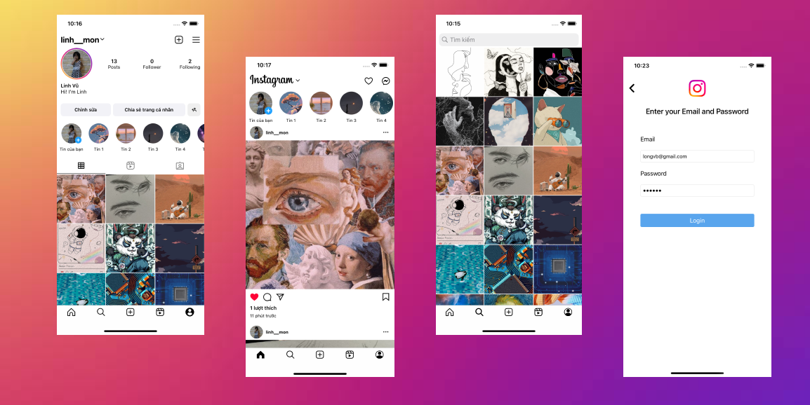
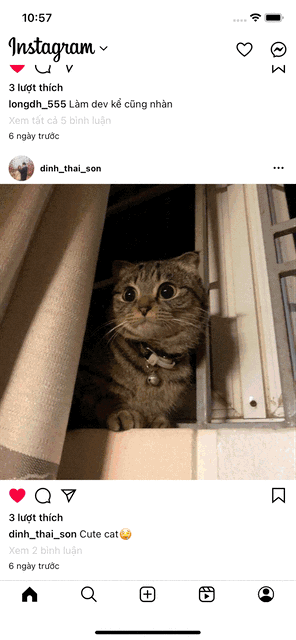
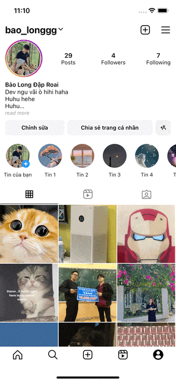
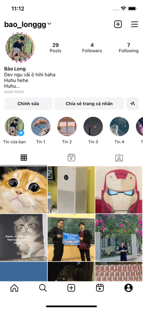
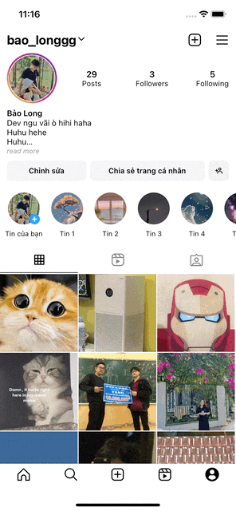

<!-- PROJECT LOGO -->
<br />
<div align="center">
  <a>
    
  </a>

  <h3 align="center">Instegrem(Instagram Clone)</h3>

  <p align="center">
    An Instagram clone app made with Swift(UIKit) and Firebase.
    <br />
    <a href="https://github.com/longvbptit/Instagram/issues">Report Bug</a>
  </p>
</div>

<!-- VIEW OF CONTENTS -->
<details>
  <summary>View of Contents</summary>
  <ol>
    <li>
      <a href="#about-the-project">About The Project</a>
    </li>
    <li>
      <a href="#features">Features</a>
    </li>
    <li><a href="#preview">Preview</a></li>
    <li><a href="#installation">Installation</a></li>
    <li><a href="#upcoming features">Upcoming Features</a></li>
    <li><a href="#contact">Contact</a></li>
  </ol>
</details>

<!-- ABOUT THE PROJECT -->
## About The Project



This project is created for the purpose of learning and practicing iOS and Swift programming skills. It is still under development, with exciting features incoming.

In this repository, I try my best to mimic the key features of the Instagram. I have utilized serveral frameworks and classes in order to create a complex UI and ehanced UX, which include:

- Architecture: 
  - MVVM
- UI: 
  - UIImagePickerController: Allow user to select image from their Photo Library or take a photo from camera. (will be update with newer framework)
  - UICollectionViewCompositionalLayout: To create a complex layout with multi section and various layout.
  - UIView animate: For smoother experience and transition.
- Database:
  - FirebaseAuth: Used for authenticating user.
  - FireStore: Used for storing and querying data of users and posts.
  - Storage: Used for storing user-generated content such as images.

<!-- Features -->
## Features

- Login and Signup Screen: 
  - Allow user to log in if they already have an account or create a new one.
- Home Screen:
  - View all posts from users that you are following.
  - Zooming post Image (has some issue, will be fixed)
  - Like post.
  - View all users who have liked the post.
  - View all comments on a post.
- Explore Screen:
  - Display all photos of user's posts excluding from your own posts.
  - Be able to search user based on usernames.
- Upload Post Screen:
  - Allow user to add photo to post from Library or Camera.
  - Post's caption is optional.
- Profile Screen:
  - Support both horizontal and vertical scrolling like Instagram. 
  - Be able to follow or unfollow user.
  - Be able to change user's info such as: fullname, username, bio and avatar.
- Not yet supported in dark mode. (Comming up)

## Preview

- Login Screen

| Log in                       | Sign up                       |
| :--------------------------: | :---------------------------: |
|  |  |

- Home Screen

Self-sizing cell and remain photo aspect ratio. Able to scroll to top when click on Home and reload when click again.

| Home | Like | Comment | Other Profile |
| :---------: | :---------: | :--------: | :------------: |
|  |  |  |  |

- Explore Screen

| Explore | Post Detail + Search |
| :--------: | :--------: |
|  |  |

- Upload Post 

| Upload post |
| :---------: |
|  |

- Profile Screen

| Profile | Edit Profile | Check Follow |
| :--------: | :--------: | :--------: |
|  |  |  |

| Settings | Log Out |
| :--------: | :--------: |
| ) |  |

## Installation

1. Clone the repo:

```sh
git clone https://github.com/longvbptit/Instagram.git
```

2. Delete the following file and folder: `Podfile.lock`, `Instegrem.xcworkspace` and `Pods`.

3. Install the dependencies through `CocoaPods` by run command:

``` sh
pod install
```

4. Set up [Firebase](https://firebase.google.com) project by following the instruction.
 
5. Delete file `GoogleService-Info.plist` and change the bundle Id.

## Upcoming Features
- Dark Mode
- Notifications for likes, comments, follow, etc.
- Add stories.
- Delete posts.
- Choose Image post like ins
- One-to-one messages.
- Reels and Video

## Contact

- Email: vuvbaolong2000@gmail.com
- Github: https://github.com/longvbptit
